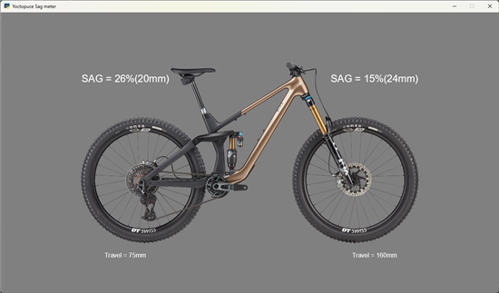

# sag_meter

Simple teste code to compute suspenssion SAG from a Yocto-RangeFinder
Read our articles on the subject for more detials:
* https://www.yoctopuce.com/EN/article/regler-ses-suspensions-avec-un-yocto-rangefinder
* https://www.yoctopuce.com/EN/article/test-of-the-python-arcade-library

There is two version of this application. ``sag_meter.py`` is a basic console application that
will display the SAG. ``sag_meter_gui.py`` is a graphical application that will display both suspenssion
sag on the same windows



## Installation:
This code require the Yoctopuce python library, which can be installed with pip
``pip install yoctopuce``

For the GUI version you will also need the [Python Arcade library](https://api.arcade.academy/en/stable/)
``pip install arcade``

## Usage of the GUI version

``python sag_meter_gui.py``

## Usage of the console version

````
Usage: sag_meter.py [-h] [-v] [-r URL] [-s TARGET] travel
Compute suspension sag from Yocto-RangeFinder

positional arguments:
  travel               suspension travel in mm

options:
  -h, --help           show this help message and exit
  -v, --verbose
  -r, --remote URL     Remote YoctoHub or VirtualHub
  -s, --serial TARGET  serial number (or logical name) of the Yocto-Range finder to use
````


